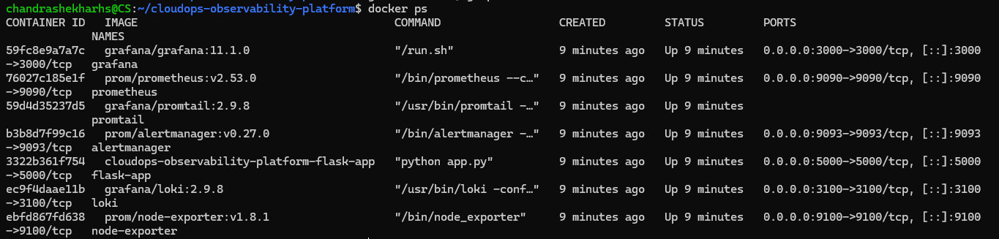
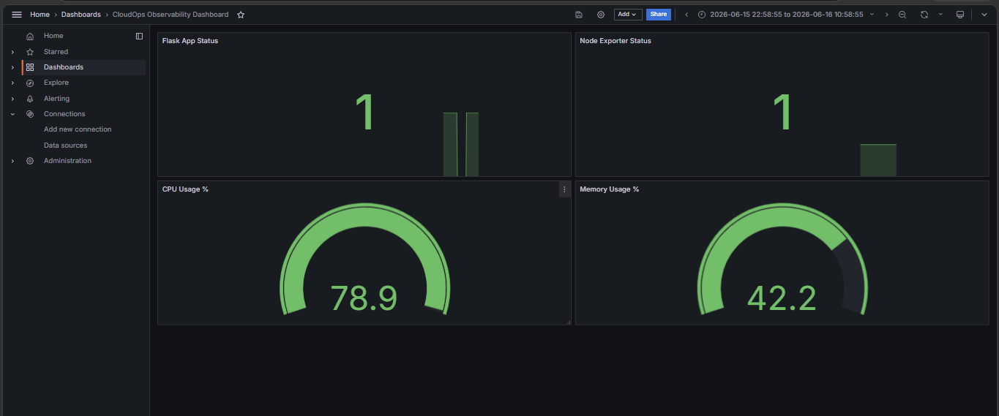
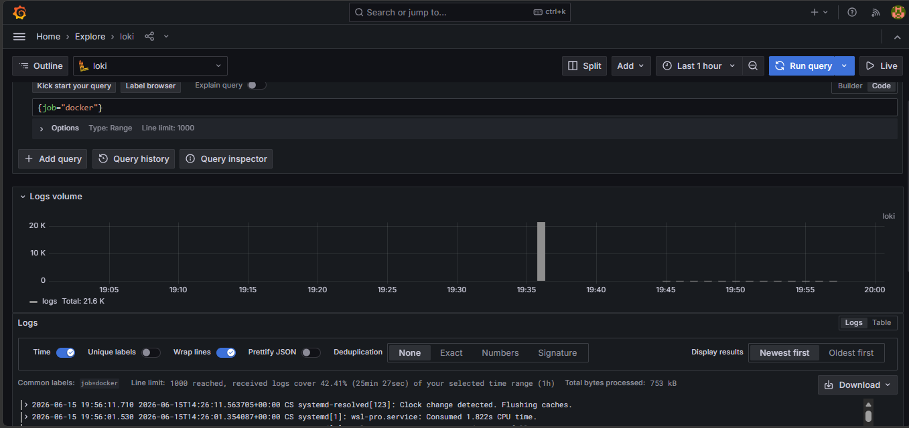
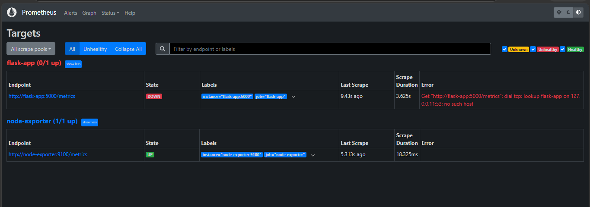
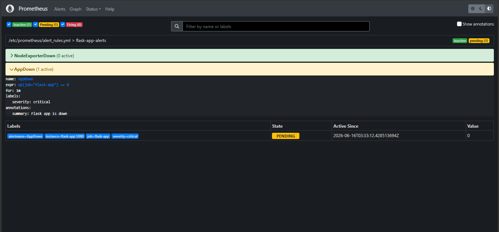
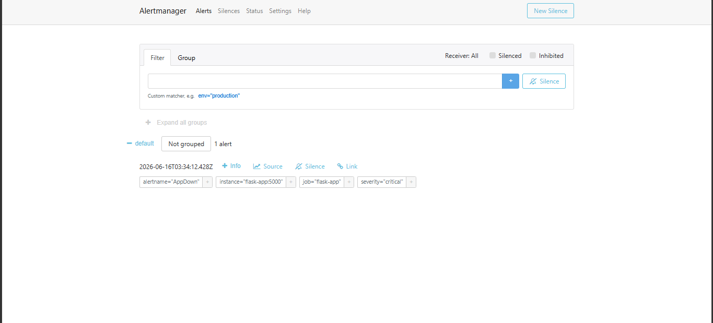
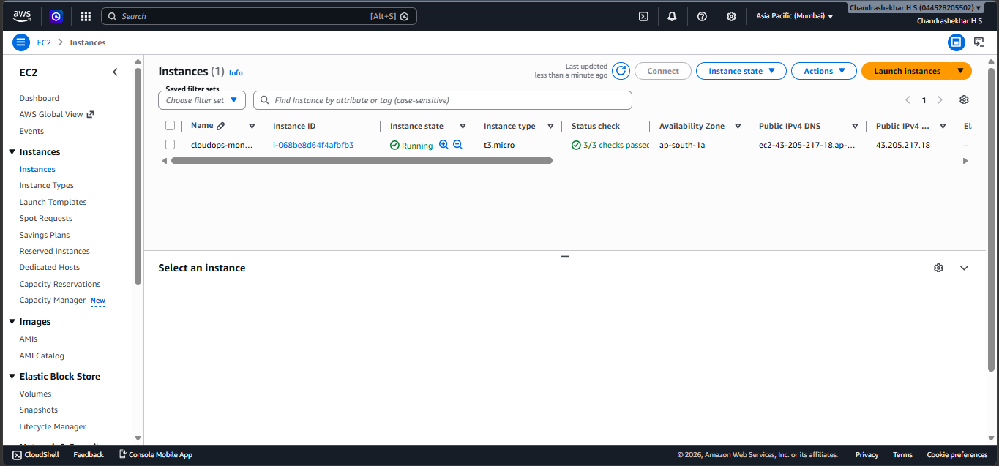
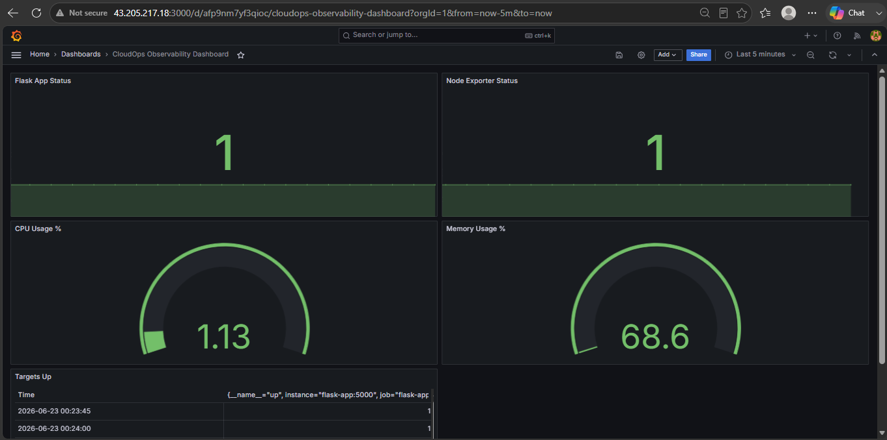
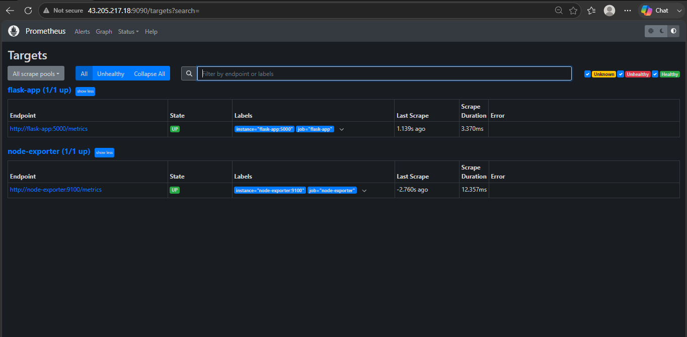
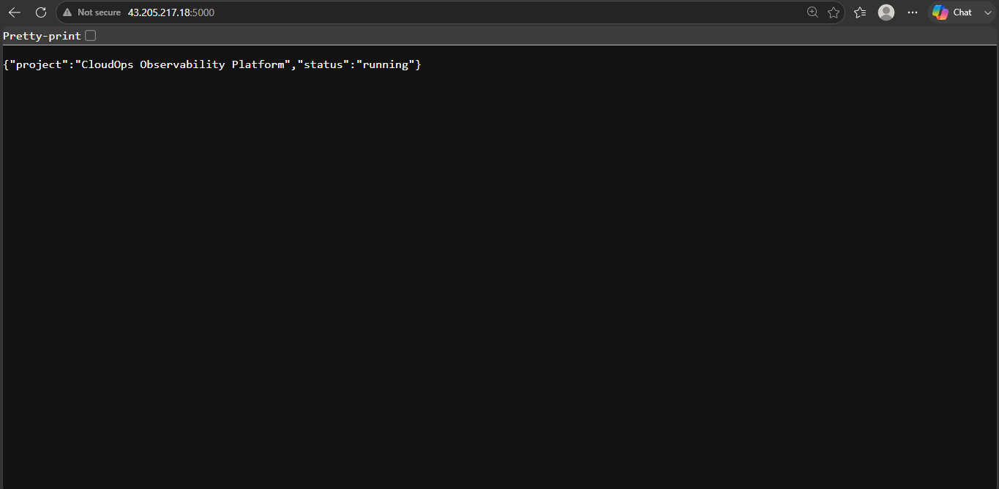

# CloudOps Observability Platform


A containerized observability platform built using Prometheus, Grafana, Loki, Promtail, Alertmanager, and Node Exporter to monitor, visualize, log, and alert on a Flask application. The complete monitoring stack is deployed and validated on AWS EC2 using Docker Compose.

## Key Highlights

- 📊 Application and infrastructure monitoring with Prometheus
- 📈 Grafana dashboards for real-time observability
- 📜 Centralized log aggregation using Loki and Promtail
- 🚨 Alerting with Prometheus Alert Rules and Alertmanager
- 🐳 Fully containerized deployment using Docker Compose
- ☁️ Successfully deployed and validated on AWS EC2 (Ubuntu 24.04)
- 🔍 Monitoring of Flask application and host system metrics


---

## Project Overview

This project demonstrates an end-to-end observability stack for a containerized Flask application.

The platform collects application and infrastructure metrics using Prometheus and Node Exporter, aggregates logs using Loki and Promtail, visualizes metrics and logs through Grafana dashboards, and manages alerts using Prometheus Alertmanager.

The entire solution is deployed using Docker Compose and successfully validated on AWS EC2.

## Architecture

```text
AWS EC2 (Ubuntu 24.04)
│
├── Flask Application
│
├── Prometheus
│   ├── Scrapes Flask Metrics
│   └── Scrapes Node Exporter Metrics
│
├── Node Exporter
│   └── System Metrics (CPU, Memory, Disk)
│
├── Alertmanager
│   └── Receives Alerts from Prometheus
│
├── Promtail
│   └── Collects Application & System Logs
│
├── Loki
│   └── Stores and Indexes Logs
│
└── Grafana
    ├── Prometheus Dashboards
    ├── Loki Logs
    └── Alert Visualization
```

## Features

### Monitoring

- Application availability monitoring using Prometheus
- Infrastructure monitoring using Node Exporter
- Target health monitoring
- Custom Prometheus alert rules
- Real-time metrics collection and visualization

### Logging

- Centralized log aggregation using Loki
- Log collection using Promtail
- Log exploration through Grafana

### Visualization

- Grafana dashboards for:
  - Flask Application Status
  - Node Exporter Status
  - CPU Usage Monitoring

### Alerting

- Prometheus alert rules
- Alertmanager integration
- Application availability alerting

---

## Technology Stack

| Component | Purpose |
|-----------|---------|
| Flask | Sample Application |
| Docker Compose | Container Orchestration |
| Prometheus | Monitoring & Metrics Collection |
| Grafana | Dashboards & Visualization |
| Loki | Log Aggregation |
| Promtail | Log Collection |
| Alertmanager | Alert Management |
| Node Exporter | Infrastructure Metrics |
| AWS EC2 | Cloud Deployment Platform |

---

## Services

| Service | Port |
|----------|------|
| Flask Application | 5000 |
| Prometheus | 9090 |
| Grafana | 3000 |
| Alertmanager | 9093 |
| Loki | 3100 |
| Node Exporter | 9100 |

---

## Screenshots

### Docker Containers



### Prometheus Targets


### Prometheus Rules


### Grafana Dashboard



### Loki Logs



### Alertmanager


## Alert Validation Evidence

The alerting pipeline was validated by intentionally stopping the Flask application container.

### Prometheus Target Down



### Alert Rule Triggered



### Alertmanager Received Alert



This test verified the complete alert flow:

Flask Application Failure → Prometheus Detection → Alert Rule Evaluation → Alertmanager Notification

---

## Running the Project

### Clone Repository

```bash
git clone https://github.com/Chandrashekhar-cloud/cloudops-observability-platform.git
cd cloudops-observability-platform
```

### Start Services

```bash
docker compose up -d
```

### Verify Running Containers

```bash
docker ps
```

### Access Services

| Service | URL |
|----------|------|
| Flask App | http://localhost:5000 |
| Prometheus | http://localhost:9090 |
| Grafana | http://localhost:3000 |
| Alertmanager | http://localhost:9093 |
| Node Exporter | http://localhost:9100/metrics |
| Loki | http://localhost:3100 |

### Stop Services

```bash
docker compose down
```

---

## Monitoring Components

### Prometheus

Prometheus scrapes metrics from:

- Flask Application
- Node Exporter

It also evaluates alert rules and forwards alerts to Alertmanager.

### Node Exporter

Node Exporter provides system-level metrics such as:

- CPU usage
- Memory usage
- System statistics

### Grafana

Grafana visualizes:

- Application health
- Infrastructure metrics
- CPU usage
- Centralized logs from Loki

### Loki & Promtail

Promtail collects log files and ships them to Loki.

Loki stores and indexes logs, which are queried and visualized through Grafana Explore.

### Alertmanager

Alertmanager receives alerts generated by Prometheus and manages alert routing and grouping.

---

## Implemented Alert Rule

### Flask Application Availability

```yaml
- alert: AppDown
  expr: up{job="flask-app"} == 0
  for: 1m
  labels:
    severity: critical
  annotations:
    summary: "Flask app is down"
```

This alert triggers when the Flask application becomes unavailable for more than one minute.

---

## Learning Outcomes

Through this project, I gained hands-on experience with:

- Prometheus Monitoring
- Prometheus Alert Rules
- Grafana Dashboard Creation
- Loki Log Aggregation
- Promtail Log Shipping
- Alertmanager Configuration
- Node Exporter Monitoring
- Docker Compose Orchestration
- Infrastructure Observability
- Metrics Collection and Analysis
- PromQL Queries
- LogQL Queries
- Containerized Monitoring Stacks

---

## AWS Deployment

This project was successfully deployed and validated on an AWS EC2 (Ubuntu 24.04 LTS) instance using Docker Compose.

### Deployment Environment

| Component | Details |
|------------|---------|
| Cloud Provider | AWS EC2 |
| Operating System | Ubuntu 24.04 LTS |
| Container Runtime | Docker |
| Orchestration | Docker Compose |

### AWS Deployment Validation

The following services were successfully deployed and verified on AWS:

| Service | Port | Status |
|----------|------|---------|
| Flask Application | 5000 | Running |
| Prometheus | 9090 | Running |
| Grafana | 3000 | Running |
| Alertmanager | 9093 | Running |
| Loki | 3100 | Running |
| Node Exporter | 9100 | Running |

### AWS EC2 Instance



### AWS Grafana Dashboard



### AWS Prometheus Targets



### AWS Flask Application



### Deployment Verification

The observability platform was validated on AWS by:

- Verifying all Docker containers were running successfully
- Confirming Prometheus target discovery and health status
- Monitoring application and infrastructure metrics through Grafana dashboards
- Validating Alertmanager integration and alert processing
- Confirming Flask application availability through the public EC2 endpoint

---

## Future Enhancements

- Email Alert Notifications
- Slack Alert Integration
- Container Monitoring using cAdvisor
- Dashboard Provisioning
- Kubernetes Deployment
- CI/CD Pipeline Integration

---

## Author

**Chandrashekhar H S**

Aspiring DevOps / SRE Engineer.

GitHub: https://github.com/Chandrashekhar-cloud
