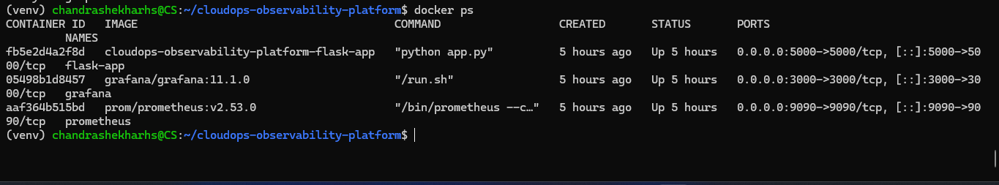
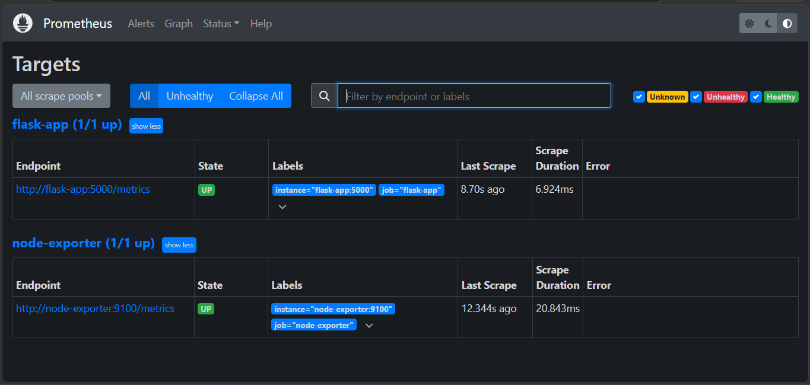
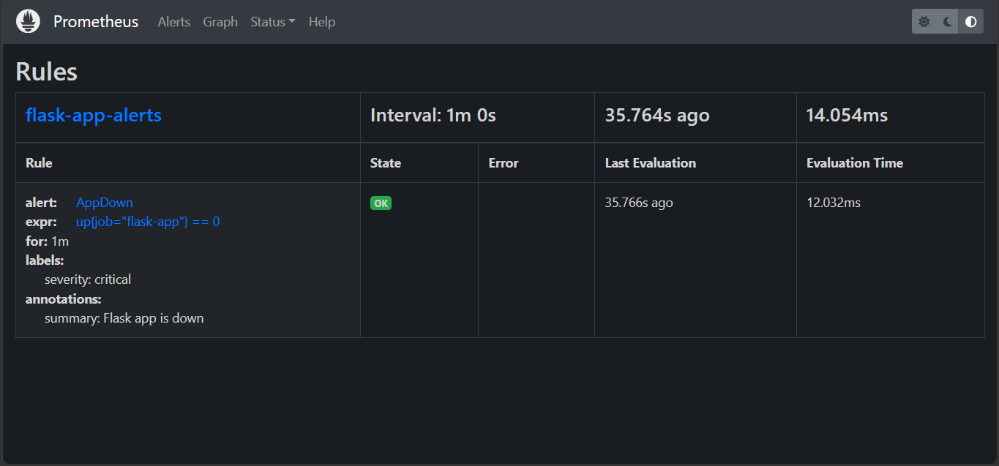
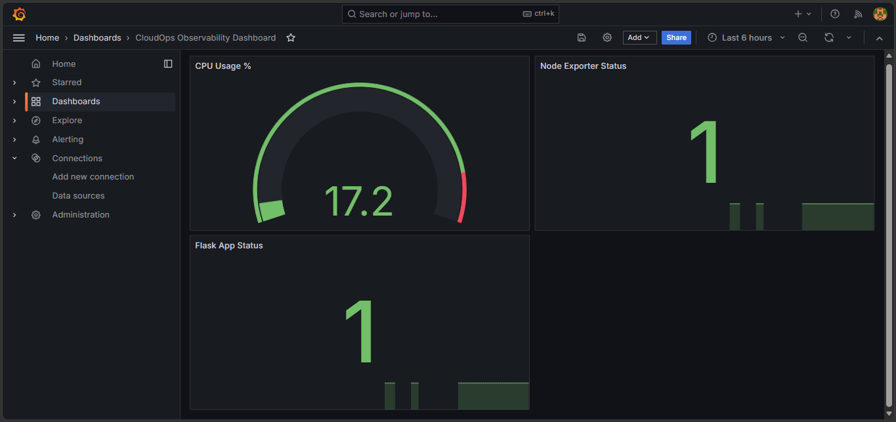
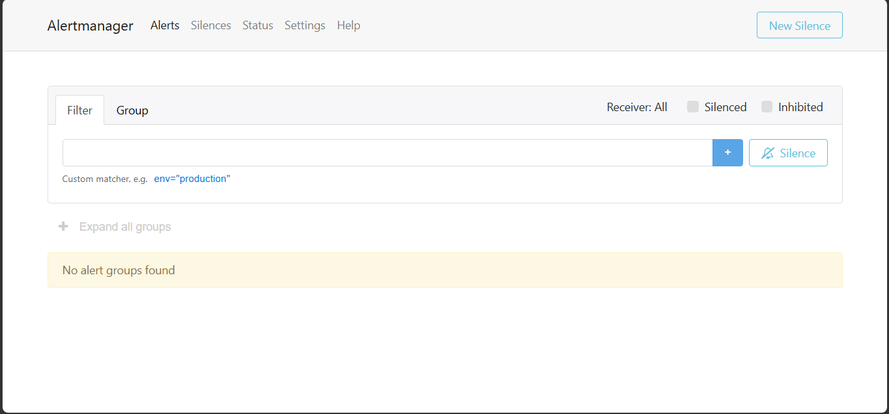

# CloudOps Observability Platform

A containerized observability platform built using Prometheus, Grafana, Loki, Promtail, Alertmanager, and Node Exporter to monitor, visualize, log, and alert on a Flask application.

---

## Project Overview

This project demonstrates a complete observability stack for a containerized application.

The platform monitors application availability and infrastructure metrics, aggregates logs, visualizes system health through Grafana dashboards, and manages alerts using Prometheus and Alertmanager.

The entire stack is containerized using Docker Compose and follows modern observability practices.

---

## Architecture

```text
                +------------------+
                |    Flask App     |
                +--------+---------+
                         |
                         |
          +--------------+--------------+
          |                             |
          v                             v

+------------------+          +------------------+
|   Prometheus     |          |    Promtail      |
| Monitoring       |          | Log Collection   |
+--------+---------+          +--------+---------+
         |                             |
         v                             v

+------------------+          +------------------+
|  Alertmanager    |          |      Loki        |
| Alert Handling   |          | Centralized Logs |
+------------------+          +--------+---------+
                                       |
                                       v

                             +------------------+
                             |     Grafana      |
                             | Dashboards & Logs|
                             +------------------+

                     +------------------+
                     |  Node Exporter   |
                     | System Metrics   |
                     +------------------+
```

---

## Features

### Monitoring

- Application availability monitoring using Prometheus
- Infrastructure monitoring using Node Exporter
- Target health monitoring
- Custom Prometheus alert rules
- Real-time metrics visualization

### Logging

- Centralized log aggregation using Loki
- Log collection using Promtail
- Log exploration and filtering through Grafana

### Visualization

- Grafana dashboards for:
  - Flask Application Status
  - Node Exporter Status
  - CPU Usage Monitoring

### Alerting

- Prometheus alert rules
- Alertmanager integration
- Application availability monitoring

### Infrastructure Enhancements

- Docker named volumes for persistent storage
- Dedicated Docker monitoring network
- Environment variable based Grafana configuration
- Multi-container orchestration using Docker Compose

---

## Technology Stack

| Component | Purpose |
|-----------|---------|
| Flask | Sample Application |
| Docker Compose | Container Orchestration |
| Prometheus | Monitoring & Alerting |
| Grafana | Visualization |
| Loki | Log Aggregation |
| Promtail | Log Collection |
| Alertmanager | Alert Management |
| Node Exporter | Infrastructure Monitoring |

---

## Services

| Service | Port |
|----------|------|
| Flask Application | 5000 |
| Prometheus | 9090 |
| Grafana | 3000 |
| Alertmanager | 9093 |
| Loki | 3100 |
| Node Exporter | 9100 |

---

## Screenshots

### Docker Containers



### Prometheus Targets



### Prometheus Rules



### Grafana Dashboard



### Alertmanager



---

## Running the Project

### Clone Repository

```bash
git clone https://github.com/Chandrashekhar-cloud/cloudops-observability-platform.git
cd cloudops-observability-platform
```

### Start Services

```bash
docker compose up -d
```

### Verify Running Containers

```bash
docker ps
```

### Stop Services

```bash
docker compose down
```

---

## Infrastructure Improvements

- Docker named volumes for persistent Prometheus, Grafana, and Loki data
- Dedicated Docker bridge network for service communication
- Environment-variable based Grafana configuration
- Centralized log aggregation using Loki and Promtail
- Containerized deployment using Docker Compose

---

## Learning Outcomes

Through this project, I gained hands-on experience with:

- Prometheus Monitoring
- Grafana Dashboard Creation
- Loki Log Aggregation
- Promtail Log Shipping
- Alertmanager Configuration
- Docker Networking
- Docker Volumes
- Container Orchestration
- Infrastructure Observability
- Metrics and Log Analysis

---

## Future Enhancements

- Email Alert Notifications
- Slack Alert Integration
- Container Metrics using cAdvisor
- Grafana Dashboard Provisioning
- Kubernetes Deployment
- CI/CD Integration

---

## Author

**Chandrashekhar H S**

Aspiring DevOps / SRE Engineer

GitHub: https://github.com/Chandrashekhar-cloud
